# Sylhetin — Database Documentation

এই ফোল্ডারে Sylhetin প্রজেক্টের ডাটাবেজ ডিজাইন সংক্রান্ত সব ডকুমেন্টেশন রাখা আছে।

> ⚠️ **এখন থেকে v2-ই মূল রেফারেন্স।** পুরনো v1 স্কিমা (সহজ প্রোটোটাইপ ভার্সন) সম্পূর্ণ প্রতিস্থাপিত হয়ে গেছে সম্পূর্ণ SRS (Majlis, Official News Hub, Friend System, Voice Comment, Messaging, Admin Panel ইত্যাদি) কভার করা v2 স্কিমা দিয়ে।

📄 **[sylhetin-database-schema-v2.md](./sylhetin-database-schema-v2.md)** — সম্পূর্ণ টেবিল-বাই-টেবিল বিবরণ (কলাম, টাইপ, ইনডেক্স, রিলেশনশিপ, Polymorphic ডিজাইন ব্যাখ্যা, Laravel migration নোট)

📄 **[sylhetin-user-manual.md](./sylhetin-user-manual.md)** — প্রজেক্টের লোকাল সেটআপ, GitHub, Laragon, ডাটাবেজ সংক্রান্ত ব্যক্তিগত রেফারেন্স

---

## ER Diagram (v2 — সম্পূর্ণ)

```mermaid
erDiagram

    %% ================= পরিচয় ও নিরাপত্তা =================
    USERS ||--o| PRIVACY_SETTINGS : "নিয়ন্ত্রণ করে"
    USERS ||--o{ OTP_VERIFICATIONS : "যাচাই করে"
    USERS ||--o{ BLOCKS : "ব্লক করে"

    %% ================= বন্ধু ও ফলো সিস্টেম =================
    USERS ||--o{ FRIEND_REQUESTS : "পাঠায়/পায়"
    USERS ||--o{ FRIENDSHIPS : "বন্ধু হয়"
    USERS ||--o{ FOLLOWS : "ফলো করে"

    %% ================= মজলিস =================
    USERS ||--o{ MAJLIS : "তৈরি করে"
    MAJLIS ||--o{ MAJLIS_MEMBERS : "সদস্য রাখে"
    USERS ||--o{ MAJLIS_MEMBERS : "যোগ দেয়"
    MAJLIS ||--o{ POSTS : "ধারণ করে"

    %% ================= পোস্ট ও এনগেজমেন্ট (Polymorphic) =================
    USERS ||--o{ POSTS : "লেখে"
    POSTS ||--o{ POST_MEDIA : "ছবি/ভিডিও রাখে"
    USERS ||--o{ REACTIONS : "দেয়"
    USERS ||--o{ COMMENTS : "লেখে (Text/Voice)"
    USERS ||--o{ SHARES : "করে"
    COMMENTS }o--o| COMMENTS : "reply to"
    USERS ||--o{ SAVED_ITEMS : "সেভ করে"

    %% ================= অফিসিয়াল নিউজ হাব =================
    USERS ||--o{ NEWS_PAGES : "মালিক হয়"
    NEWS_PAGES ||--o{ NEWS_PAGE_STAFF : "স্টাফ রাখে"
    USERS ||--o{ NEWS_PAGE_STAFF : "স্টাফ হয়"
    NEWS_PAGES ||--o{ NEWS_POSTS : "পাবলিশ করে"
    NEWS_CATEGORIES ||--o{ NEWS_POSTS : "শ্রেণীবদ্ধ করে"
    NEWS_POSTS ||--o{ NEWS_POST_MEDIA : "ছবি রাখে"
    NEWS_PAGES ||--o{ NEWS_PAGE_FOLLOWERS : "ফলোয়ার রাখে"
    USERS ||--o{ NEWS_PAGE_FOLLOWERS : "ফলো করে"

    %% ================= প্রাইভেট মেসেজিং =================
    CONVERSATIONS ||--o{ CONVERSATION_PARTICIPANTS : "অংশগ্রহণকারী রাখে"
    USERS ||--o{ CONVERSATION_PARTICIPANTS : "অংশ নেয়"
    CONVERSATIONS ||--o{ MESSAGES : "ধারণ করে"
    USERS ||--o{ MESSAGES : "পাঠায়"

    %% ================= নোটিফিকেশন ও রিপোর্ট =================
    USERS ||--o{ NOTIFICATIONS : "পায়"
    USERS ||--o{ REPORTS : "রিপোর্ট করে"

    %% ================= অ্যাডমিন =================
    USERS ||--o{ ADMIN_LOGS : "অ্যাকশন নেয়"

    USERS {
        bigint id PK
        string name
        string username UK
        string phone UK
        string email
        string password_hash
        string avatar_url
        string cover_url
        text bio
        string country
        string district
        string upazila
        string union_name
        string current_location
        string profession
        string language_preference "sylheti/bangla/english"
        string role "user/moderator/admin/super_admin"
        string status "active/suspended/banned"
        boolean is_verified
        timestamp last_active_at
        timestamp otp_verified_at
        timestamp created_at
        timestamp updated_at
    }

    OTP_VERIFICATIONS {
        bigint id PK
        string phone
        string otp_code
        timestamp expires_at
        timestamp verified_at
        timestamp created_at
    }

    PRIVACY_SETTINGS {
        bigint id PK
        bigint user_id FK
        string who_can_send_friend_request "everyone/friends_of_friends/no_one"
        string who_can_message "everyone/friends/no_one"
        string who_can_see_profile "everyone/friends/no_one"
        string who_can_see_posts "everyone/friends/no_one"
        string who_can_comment "everyone/friends/no_one"
    }

    BLOCKS {
        bigint id PK
        bigint blocker_id FK
        bigint blocked_id FK
        timestamp created_at
    }

    FRIEND_REQUESTS {
        bigint id PK
        bigint sender_id FK
        bigint receiver_id FK
        string status "pending/accepted/declined"
        timestamp created_at
        timestamp responded_at
    }

    FRIENDSHIPS {
        bigint id PK
        bigint user_one_id FK
        bigint user_two_id FK
        timestamp created_at
    }

    FOLLOWS {
        bigint id PK
        bigint follower_id FK
        bigint followed_id FK
        timestamp created_at
    }

    MAJLIS {
        bigint id PK
        string name
        string slug UK
        string cover_photo
        string logo
        text description
        text rules
        string category
        string visibility "public/private"
        int member_count
        bigint created_by FK
        string status "active/suspended"
        timestamp created_at
        timestamp updated_at
    }

    MAJLIS_MEMBERS {
        bigint id PK
        bigint majlis_id FK
        bigint user_id FK
        string role "member/moderator/admin"
        string status "approved/pending"
        timestamp joined_at
    }

    POSTS {
        bigint id PK
        bigint user_id FK
        bigint majlis_id FK "nullable"
        text content
        boolean is_pinned
        boolean is_deleted
        timestamp created_at
        timestamp updated_at
    }

    POST_MEDIA {
        bigint id PK
        bigint post_id FK
        string media_type "image/video(future)"
        string url
        tinyint sort_order
    }

    REACTIONS {
        bigint id PK
        string reactable_type "Post/NewsPost"
        bigint reactable_id
        bigint user_id FK
        string type "like/love/haha/wow/sad/angry"
        timestamp created_at
    }

    COMMENTS {
        bigint id PK
        string commentable_type "Post/NewsPost"
        bigint commentable_id
        bigint user_id FK
        bigint parent_comment_id FK "nullable"
        string type "text/voice"
        text content "nullable, text হলে"
        string audio_url "nullable, voice হলে"
        smallint duration_seconds "max 30"
        timestamp created_at
    }

    SHARES {
        bigint id PK
        string shareable_type "Post/NewsPost"
        bigint shareable_id
        bigint user_id FK
        timestamp created_at
    }

    SAVED_ITEMS {
        bigint id PK
        bigint user_id FK
        string saveable_type "Post/NewsPost"
        bigint saveable_id
        timestamp created_at
    }

    NEWS_PAGES {
        bigint id PK
        string name
        string slug UK
        string logo
        string cover_photo
        text description
        string page_type "newspaper/online_portal/television"
        string website
        string contact_info
        string address
        boolean verified_badge
        string status "pending/approved/rejected/suspended"
        bigint owner_user_id FK
        int followers_count
        timestamp created_at
    }

    NEWS_PAGE_STAFF {
        bigint id PK
        bigint news_page_id FK
        bigint user_id FK
        string role "owner/editor"
        timestamp joined_at
    }

    NEWS_PAGE_FOLLOWERS {
        bigint id PK
        bigint news_page_id FK
        bigint user_id FK
        timestamp created_at
    }

    NEWS_CATEGORIES {
        bigint id PK
        string name
        string slug UK
    }

    NEWS_POSTS {
        bigint id PK
        bigint news_page_id FK
        bigint category_id FK
        string headline
        text short_description
        text full_content
        string reporter_name "nullable"
        boolean is_featured
        timestamp publish_date
        timestamp created_at
        timestamp updated_at
    }

    NEWS_POST_MEDIA {
        bigint id PK
        bigint news_post_id FK
        string url
        tinyint sort_order
    }

    CONVERSATIONS {
        bigint id PK
        string type "direct/group(future)"
        timestamp created_at
    }

    CONVERSATION_PARTICIPANTS {
        bigint id PK
        bigint conversation_id FK
        bigint user_id FK
        timestamp joined_at
    }

    MESSAGES {
        bigint id PK
        bigint conversation_id FK
        bigint sender_id FK
        string type "text/image/voice"
        text content "nullable"
        string media_url "nullable"
        smallint duration_seconds "voice হলে, max 30"
        timestamp created_at
    }

    NOTIFICATIONS {
        bigint id PK
        bigint user_id FK "প্রাপক"
        bigint actor_id FK "যে কাজটা করেছে"
        string type "like/comment/voice_comment/friend_request/friend_accepted/follow/message/majlis_invite/majlis_join/official_news/mention"
        string notifiable_type "Post/Comment/Message/Majlis/NewsPost"
        bigint notifiable_id "nullable"
        boolean is_read
        timestamp created_at
    }

    REPORTS {
        bigint id PK
        bigint reporter_id FK
        string reportable_type "User/Post/Comment/Majlis/NewsPost"
        bigint reportable_id
        string reason "fake_news/spam/harassment/violence/copyright/fake_account/others"
        string status "pending/reviewed/resolved"
        timestamp created_at
    }

    ADMIN_LOGS {
        bigint id PK
        bigint admin_user_id FK
        string action
        string target_type "nullable"
        bigint target_id "nullable"
        text notes "nullable"
        timestamp created_at
    }
```

> GitHub-এ এই পেজটা দেখলে উপরের কোড ব্লকটা স্বয়ংক্রিয়ভাবে ভিজ্যুয়াল ER ডায়াগ্রাম হিসেবে রেন্ডার হয়ে যাবে। ডোমেইন-ভিত্তিক ছোট ছোট (সহজে পড়ার মতো) ডায়াগ্রাম পেতে [sylhetin-database-schema-v2.md](./sylhetin-database-schema-v2.md)-এর ২ নম্বর সেকশন দেখুন।

---

## টেবিল তালিকা (সংক্ষেপে) — মোট ২৭টি

| টেবিল | কাজ |
|---|---|
| `users` | ব্যবহারকারীর প্রোফাইল, ভাষা, রোল, স্ট্যাটাস |
| `otp_verifications` | ফোন নাম্বার OTP যাচাই |
| `privacy_settings` | কে ফ্রেন্ড রিকোয়েস্ট/মেসেজ/প্রোফাইল/পোস্ট দেখতে পারবে |
| `blocks` | ব্লক করা ইউজার |
| `friend_requests` | বন্ধুত্বের অনুরোধ |
| `friendships` | নিশ্চিত হওয়া বন্ধুত্ব |
| `follows` | একমুখী ফলো |
| `majlis` | কমিউনিটি গ্রুপ |
| `majlis_members` | মজলিসের সদস্যপদ |
| `posts` | সাধারণ পোস্ট (ফ্রেন্ড/মজলিস ফিড) |
| `post_media` | পোস্টের ছবি/ভিডিও |
| `reactions` | ৬ ধরনের রিয়েকশন (Polymorphic — Post/News) |
| `comments` | টেক্সট ও ভয়েস কমেন্ট (Polymorphic) |
| `shares` | শেয়ার (Polymorphic) |
| `saved_items` | সেভ করা পোস্ট/নিউজ (Polymorphic) |
| `news_pages` | যাচাইকৃত সংবাদমাধ্যমের পেজ |
| `news_page_staff` | নিউজ পেজের অ্যাডমিন/এডিটর |
| `news_page_followers` | নিউজ পেজের ফলোয়ার |
| `news_categories` | নিউজ ক্যাটাগরি |
| `news_posts` | প্রকাশিত খবর |
| `news_post_media` | খবরের ছবি |
| `conversations` | প্রাইভেট চ্যাট থ্রেড |
| `conversation_participants` | চ্যাটের অংশগ্রহণকারী |
| `messages` | টেক্সট/ছবি/ভয়েস মেসেজ |
| `notifications` | নোটিফিকেশন (Polymorphic) |
| `reports` | রিপোর্ট সিস্টেম (Polymorphic) |
| `admin_logs` | অ্যাডমিনের প্রতিটা অ্যাকশনের লগ |

বিস্তারিত জানতে [sylhetin-database-schema-v2.md](./sylhetin-database-schema-v2.md) দেখুন।
