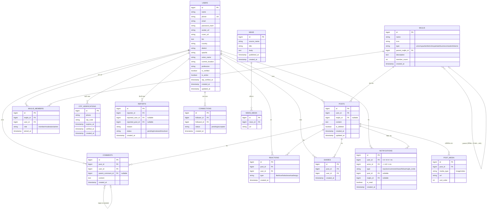

# SylNet — Database Documentation

এই ফোল্ডারে SylNet প্রজেক্টের ডাটাবেজ ডিজাইন সংক্রান্ত সব ডকুমেন্টেশন রাখা আছে।

📄 **[sylnet-database-schema.md](./sylnet-database-schema.md)** — সম্পূর্ণ টেবিল-বাই-টেবিল বিবরণ (কলাম, টাইপ, ইনডেক্স, রিলেশনশিপ, Laravel migration নোট)

---

## ER Diagram

> GitHub-এ এই পেজটা দেখলে উপরের কোড ব্লকটা স্বয়ংক্রিয়ভাবে ভিজ্যুয়াল ER ডায়াগ্রাম হিসেবে রেন্ডার হয়ে যাবে।

---

## টেবিল তালিকা (সংক্ষেপে)

| টেবিল | কাজ |
|---|---|
| `users` | ব্যবহারকারীর প্রোফাইল ও পরিচয় |
| `otp_verifications` | ফোন নাম্বার OTP যাচাই |
| `majlis` | কমিউনিটি গ্রুপ (ইউনিয়ন → উপজেলা → জেলা হায়ারার্কি) |
| `majlis_members` | কে কোন মজলিসে যোগ দিয়েছে |
| `posts` | পোস্ট |
| `post_media` | পোস্টের ছবি/ভিডিও |
| `reactions` | ৬ ধরনের সিলেটি রিয়েকশন |
| `comments` | মন্তব্য |
| `shares` | শেয়ার |
| `connections` | ফলো / পিপল ইউ মে নো |
| `news` | Surma Faror Khobor থেকে আসা খবর |
| `news_media` | খবরের ছবি |
| `notifications` | নোটিফিকেশন |
| `reports` | রিপোর্ট সিস্টেম |

বিস্তারিত জানতে [sylnet-database-schema.md](./sylnet-database-schema.md) দেখুন।
