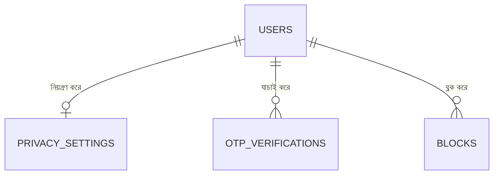
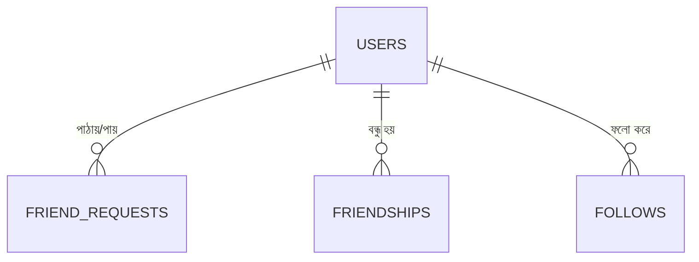
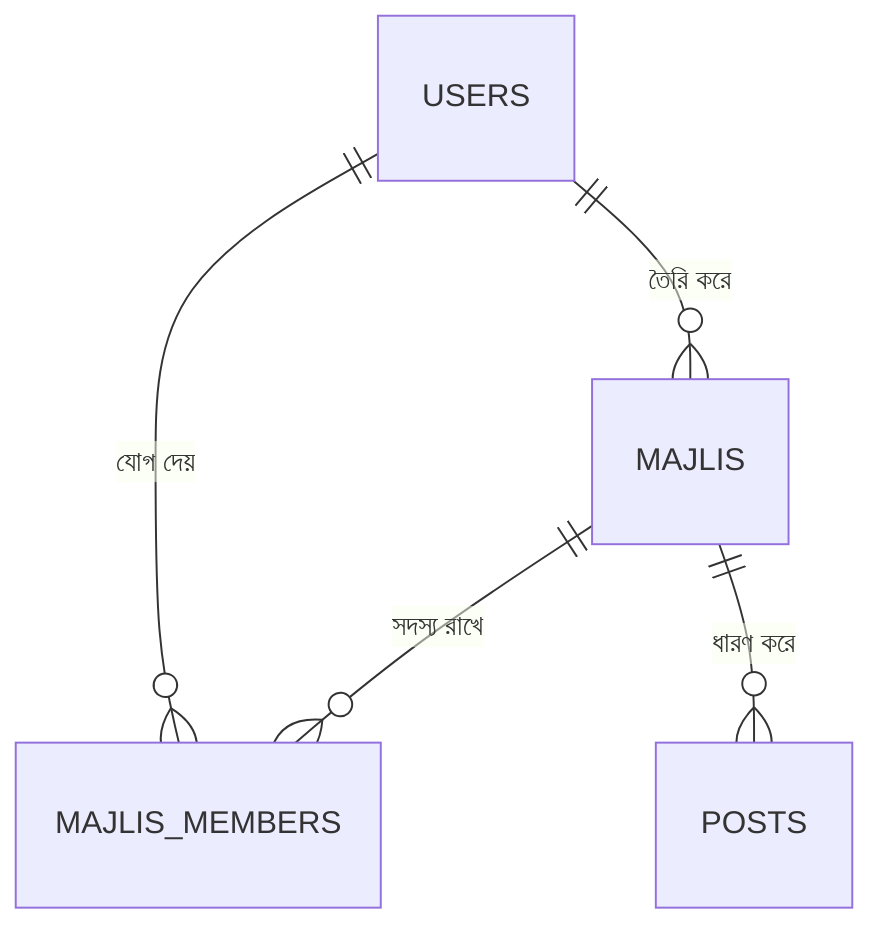
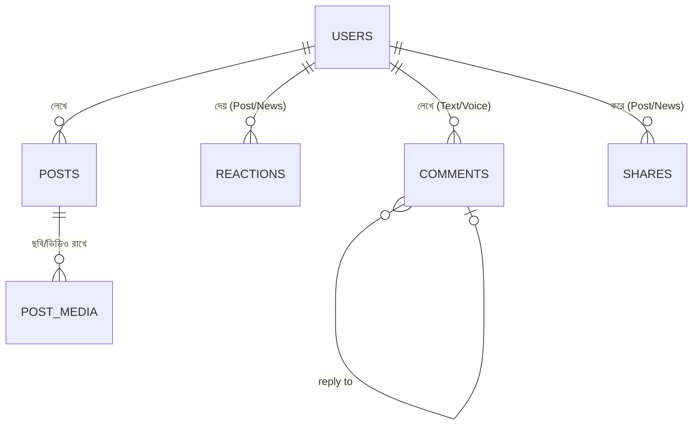
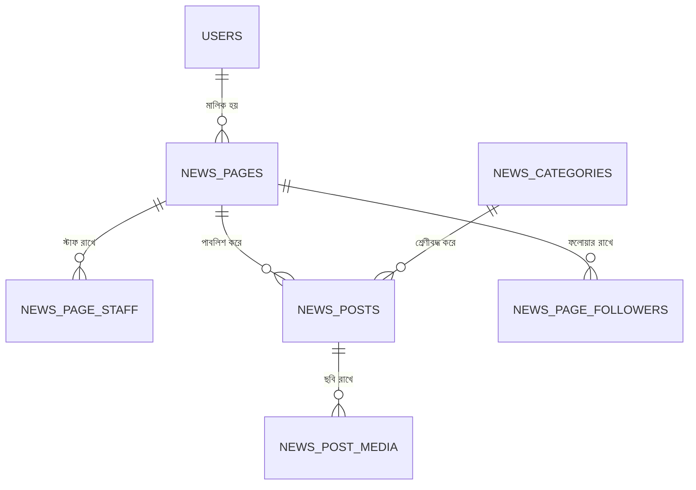
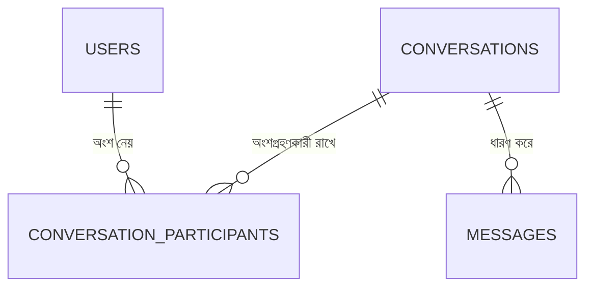

# Sylhetin Database Schema — Version 2.0 (সম্পূর্ণ SRS অনুযায়ী)

এই ডকুমেন্টে Sylhetin App Development Document (Part 1, 2, 3)-এ বর্ণিত সম্পূর্ণ ফিচার সেট বিবেচনা করে ডাটাবেজ ডিজাইন করা হয়েছে। এটা v1 (আগের সহজ প্রোটোটাইপ স্কিমা)-এর জায়গায় সম্পূর্ণ প্রতিস্থাপন — এখন থেকে এই v2-ই মূল রেফারেন্স।

**মোট টেবিল সংখ্যা: ২৭টি**

ER ডায়াগ্রামের সম্পূর্ণ ভার্সন: `sylhetin-erd-v2.mermaid`

---

## ১. v1 থেকে যা যা পাল্টেছে

| বিষয় | v1 (আগে) | v2 (এখন) |
|---|---|---|
| রিয়েকশন | ৬টা সিলেটি রিয়েকশন | ✅ অপরিবর্তিত — ৬টা রিয়েকশনই থাকছে |
| নিউজ | Surma Faror Khobor থেকে অটো-স্ক্র্যাপ করা সাধারণ খবর | ❌ সম্পূর্ণ বাদ, নতুন **Official News Hub** সিস্টেম যোগ হলো (যাচাইকৃত সংবাদমাধ্যম নিজস্ব পেজ থেকে খবর পাবলিশ করবে) |
| রিয়েকশন/কমেন্ট/শেয়ার | শুধু পোস্টের জন্য (সরাসরি `post_id` কলাম) | **Polymorphic** করা হয়েছে — এখন একই টেবিল Post আর NewsPost দুটোতেই কাজ করবে |
| কমেন্ট | শুধু টেক্সট | Text + Voice Comment (৩০ সেকেন্ড পর্যন্ত) |
| সম্পর্ক | শুধু "follow" ধরনের connection | Follow (একমুখী) + Friend Request/Friendship (দ্বিমুখী, accept লাগবে) — দুটো আলাদা সিস্টেম |
| মেসেজিং | ছিল না | নতুন — Text/Image/Voice প্রাইভেট মেসেজিং |
| প্রাইভেসি | ছিল না | নতুন — কে ফ্রেন্ড রিকোয়েস্ট/মেসেজ/প্রোফাইল/পোস্ট দেখতে পারবে তা নিয়ন্ত্রণ |
| অ্যাডমিন | ছিল না | নতুন — role-based admin, admin action log |
| ব্লক | ছিল না | নতুন |
| সেভ পোস্ট | ছিল না | নতুন (Polymorphic — Post ও News দুটোই সেভ করা যাবে) |

---

## ২. ডোমেইন-ভিত্তিক ছোট ডায়াগ্রাম (সহজে বোঝার জন্য)

### ২.১ পরিচয় ও নিরাপত্তা

### ২.২ বন্ধু ও ফলো সিস্টেম

### ২.৩ মজলিস

### ২.৪ পোস্ট ও এনগেজমেন্ট

### ২.৫ অফিসিয়াল নিউজ হাব

### ২.৬ প্রাইভেট মেসেজিং

---

## ৩. Polymorphic রিলেশন — কেন ও কীভাবে

`reactions`, `comments`, `shares`, `saved_items`, `notifications`, `reports` — এই ৬টা টেবিল **polymorphic** করা হয়েছে, মানে একটা কলাম (`*_type`) দিয়ে বোঝানো হয় রেকর্ডটা কোন মডেলের সাথে যুক্ত (যেমন `Post` নাকি `NewsPost`), আর আরেকটা কলাম (`*_id`) সেই মডেলের আইডি রাখে।

**কেন এভাবে করা হলো:** SRS-এ বলা আছে ইউজার Post আর News দুটোতেই Like/Comment/Share করতে পারবে। যদি আলাদা আলাদা টেবিল বানাতাম (যেমন `post_reactions`, `news_reactions`), তাহলে কোড দ্বিগুণ হতো আর ভবিষ্যতে Marketplace/Job পোস্টেও রিয়েকশন যোগ করতে চাইলে আবার নতুন টেবিল লাগতো। Polymorphic ডিজাইনে একটাই টেবিল, একটাই কোড — নতুন কনটেন্ট টাইপ যোগ করাও সহজ।

Laravel-এ এটা `morphTo()` / `morphMany()` দিয়ে সরাসরি সাপোর্ট করে, তাই কোড লেখা জটিল হবে না।

---

## ৪. টেবিল রেফারেন্স (বিস্তারিত)

### ৪.১ users
| Column | Type | Note |
|---|---|---|
| id | BIGINT UNSIGNED PK | |
| name | VARCHAR(100) | |
| username | VARCHAR(50), UNIQUE | প্রোফাইল লিংকের জন্য (যেমন sylhetin.com/@rahim) |
| phone | VARCHAR(20), UNIQUE | |
| email | VARCHAR(150), NULLABLE | |
| password_hash | VARCHAR(255), NULLABLE | |
| avatar_url, cover_url | VARCHAR(255), NULLABLE | ছবি না দিলে ডিফল্ট "আলী আমজদের ঘড়ি" ছবি অ্যাপ লজিকে বসবে (কলামে null-ই থাকবে) |
| bio | TEXT, NULLABLE | |
| country, district, upazila, union_name, current_location, profession | VARCHAR | প্রোফাইল তথ্য |
| language_preference | VARCHAR(10), DEFAULT 'sylheti' | sylheti/bangla/english |
| role | VARCHAR(20), DEFAULT 'user' | user/moderator/admin/super_admin |
| status | VARCHAR(20), DEFAULT 'active' | active/suspended/banned |
| is_verified | BOOLEAN, DEFAULT false | ✅ ব্যাজ |
| last_active_at | TIMESTAMP, NULLABLE | Online/Active স্ট্যাটাসের ভবিষ্যৎ ফিচারের ভিত্তি |
| otp_verified_at | TIMESTAMP, NULLABLE | |
| created_at / updated_at | TIMESTAMP | `created_at` = "Joined Date" |

**ইনডেক্স:** `phone` (unique), `username` (unique), `(district, upazila, union_name)`

---

### ৪.২ otp_verifications
আগের v1-এর মতোই অপরিবর্তিত — `phone`, `otp_code`, `expires_at`, `verified_at`, `created_at`।

---

### ৪.৩ privacy_settings
| Column | Type | Note |
|---|---|---|
| id | PK | |
| user_id | FK → users.id, UNIQUE | একজন ইউজারের একটাই সেটিংস রেকর্ড |
| who_can_send_friend_request | VARCHAR(20) | everyone / friends_of_friends / no_one |
| who_can_message | VARCHAR(20) | everyone / friends / no_one |
| who_can_see_profile | VARCHAR(20) | everyone / friends / no_one |
| who_can_see_posts | VARCHAR(20) | everyone / friends / no_one |
| who_can_comment | VARCHAR(20) | everyone / friends / no_one |

---

### ৪.৪ blocks
| Column | Type | Note |
|---|---|---|
| id | PK | |
| blocker_id | FK → users.id | যে ব্লক করেছে |
| blocked_id | FK → users.id | যাকে ব্লক করা হয়েছে |
| created_at | TIMESTAMP | |

**ইনডেক্স:** UNIQUE `(blocker_id, blocked_id)`

---

### ৪.৫ friend_requests
| Column | Type | Note |
|---|---|---|
| id | PK | |
| sender_id | FK → users.id | |
| receiver_id | FK → users.id | |
| status | VARCHAR(15) | pending / accepted / declined |
| created_at | TIMESTAMP | |
| responded_at | TIMESTAMP, NULLABLE | |

**নোট:** Accept হলে এখান থেকে একটা রেকর্ড `friendships`-এ কপি হবে (অ্যাপ লজিকে)।

---

### ৪.৬ friendships
| Column | Type | Note |
|---|---|---|
| id | PK | |
| user_one_id | FK → users.id | সবসময় ছোট id-টা এখানে রাখা হবে (কনভেনশন) |
| user_two_id | FK → users.id | |
| created_at | TIMESTAMP | |

**ইনডেক্স:** UNIQUE `(user_one_id, user_two_id)`

---

### ৪.৭ follows
| Column | Type | Note |
|---|---|---|
| id | PK | |
| follower_id | FK → users.id | |
| followed_id | FK → users.id | |
| created_at | TIMESTAMP | |

**নোট:** এটা Facebook-এর "Follow" এর মতো একমুখী — Friend হওয়া লাগে না।

---

### ৪.৮ majlis
| Column | Type | Note |
|---|---|---|
| id | PK | |
| name | VARCHAR(150) | |
| slug | VARCHAR(160), UNIQUE | URL-friendly নাম |
| cover_photo, logo | VARCHAR(255), NULLABLE | |
| description | TEXT, NULLABLE | |
| rules | TEXT, NULLABLE | |
| category | VARCHAR(50) | যেমন: এলাকা-ভিত্তিক, প্রবাসী, ব্যবসায়িক, ছাত্র সংগঠন |
| visibility | VARCHAR(10) | public / private |
| member_count | INT, DEFAULT 0 | Denormalized কাউন্ট |
| created_by | FK → users.id | প্রথম Admin |
| status | VARCHAR(15), DEFAULT 'active' | active / suspended |
| created_at / updated_at | TIMESTAMP | |

---

### ৪.৯ majlis_members
| Column | Type | Note |
|---|---|---|
| id | PK | |
| majlis_id | FK → majlis.id | |
| user_id | FK → users.id | |
| role | VARCHAR(15), DEFAULT 'member' | member / moderator / admin |
| status | VARCHAR(15), DEFAULT 'approved' | approved / pending — Private Majlis-এ join request approve করা লাগবে |
| joined_at | TIMESTAMP | |

**ইনডেক্স:** UNIQUE `(majlis_id, user_id)`

---

### ৪.১০ posts
| Column | Type | Note |
|---|---|---|
| id | PK | |
| user_id | FK → users.id | |
| majlis_id | FK → majlis.id, NULLABLE | মজলিসে পোস্ট করলে |
| content | TEXT, NULLABLE | |
| is_pinned | BOOLEAN, DEFAULT false | মজলিস অ্যাডমিন পিন করতে পারবে |
| is_deleted | BOOLEAN, DEFAULT false | Soft delete |
| created_at / updated_at | TIMESTAMP | |

---

### ৪.১১ post_media
| Column | Type | Note |
|---|---|---|
| id | PK | |
| post_id | FK → posts.id | |
| media_type | VARCHAR(10) | image (এখন), video (ভবিষ্যৎ) |
| url | VARCHAR(255) | |
| sort_order | TINYINT, DEFAULT 0 | |

---

### ৪.১২ reactions *(Polymorphic)*
| Column | Type | Note |
|---|---|---|
| id | PK | |
| reactable_type | VARCHAR(50) | `App\Models\Post` অথবা `App\Models\NewsPost` |
| reactable_id | BIGINT UNSIGNED | |
| user_id | FK → users.id | |
| type | VARCHAR(10) | like (👍 ফছন অইছে) / love (❤️ ভালা লাগছে) / haha (😂 হা হা) / wow (😮 ছমতখার) / sad (😢 খশটো ফাইলাম) / angry (😡 রাগ খরলাম) |
| created_at | TIMESTAMP | |

**ইনডেক্স:** UNIQUE `(reactable_type, reactable_id, user_id)`

---

### ৪.১৩ comments *(Polymorphic, Text + Voice)*
| Column | Type | Note |
|---|---|---|
| id | PK | |
| commentable_type | VARCHAR(50) | `App\Models\Post` অথবা `App\Models\NewsPost` |
| commentable_id | BIGINT UNSIGNED | |
| user_id | FK → users.id | |
| parent_comment_id | FK → comments.id, NULLABLE | রিপ্লাই থ্রেড |
| type | VARCHAR(10) | text / voice |
| content | TEXT, NULLABLE | `type = text` হলে |
| audio_url | VARCHAR(255), NULLABLE | `type = voice` হলে |
| duration_seconds | SMALLINT, NULLABLE | সর্বোচ্চ ৩০ সেকেন্ড (অ্যাপ ভ্যালিডেশনে চেক হবে) |
| created_at | TIMESTAMP | |

---

### ৪.১৪ shares *(Polymorphic)*
| Column | Type | Note |
|---|---|---|
| id | PK | |
| shareable_type | VARCHAR(50) | `App\Models\Post` অথবা `App\Models\NewsPost` |
| shareable_id | BIGINT UNSIGNED | |
| user_id | FK → users.id | |
| created_at | TIMESTAMP | |

---

### ৪.১৫ saved_items *(Polymorphic)*
| Column | Type | Note |
|---|---|---|
| id | PK | |
| user_id | FK → users.id | |
| saveable_type | VARCHAR(50) | `App\Models\Post` অথবা `App\Models\NewsPost` |
| saveable_id | BIGINT UNSIGNED | |
| created_at | TIMESTAMP | |

**নোট:** More Menu-তে "Saved Posts" আর "Saved News" — দুটোই আসলে এই একই টেবিল থেকে `saveable_type` দিয়ে ফিল্টার করে দেখানো হবে।

---

### ৪.১৬ news_pages
| Column | Type | Note |
|---|---|---|
| id | PK | |
| name | VARCHAR(150) | |
| slug | VARCHAR(160), UNIQUE | |
| logo, cover_photo | VARCHAR(255), NULLABLE | |
| description | TEXT, NULLABLE | "About" |
| page_type | VARCHAR(20) | newspaper / online_portal / television |
| website | VARCHAR(255), NULLABLE | |
| contact_info | VARCHAR(255), NULLABLE | |
| address | VARCHAR(255), NULLABLE | |
| verified_badge | BOOLEAN, DEFAULT false | |
| status | VARCHAR(15), DEFAULT 'pending' | pending / approved / rejected / suspended |
| owner_user_id | FK → users.id | যিনি পেজ খুলেছেন |
| followers_count | INT, DEFAULT 0 | Denormalized |
| created_at | TIMESTAMP | |

**নোট:** শুধুমাত্র Admin Approval-এর পর `status = approved` হবে, তখনই পেজ থেকে News Post publish করা যাবে (অ্যাপ লজিকে চেক হবে)।

---

### ৪.১৭ news_page_staff
| Column | Type | Note |
|---|---|---|
| id | PK | |
| news_page_id | FK → news_pages.id | |
| user_id | FK → users.id | |
| role | VARCHAR(15) | owner / editor |
| joined_at | TIMESTAMP | |

---

### ৪.১৮ news_page_followers
| Column | Type | Note |
|---|---|---|
| id | PK | |
| news_page_id | FK → news_pages.id | |
| user_id | FK → users.id | |
| created_at | TIMESTAMP | |

**ইনডেক্স:** UNIQUE `(news_page_id, user_id)`

---

### ৪.১৯ news_categories
| Column | Type | Note |
|---|---|---|
| id | PK | |
| name | VARCHAR(50) | সিলেট, বাংলাদেশ, আন্তর্জাতিক, রাজনীতি, অর্থনীতি, খেলাধুলা, শিক্ষা, ইসলাম, প্রযুক্তি, বিনোদন, প্রবাস |
| slug | VARCHAR(60), UNIQUE | |

**নোট:** "সর্বশেষ" আলাদা ক্যাটাগরি না — এটা `news_posts`-কে `publish_date` অনুযায়ী sort করে দেখানো একটা view/query, ডাটাবেজে আলাদা এন্ট্রি লাগবে না।

---

### ৪.২০ news_posts
| Column | Type | Note |
|---|---|---|
| id | PK | |
| news_page_id | FK → news_pages.id | |
| category_id | FK → news_categories.id | |
| headline | VARCHAR(255) | |
| short_description | TEXT | |
| full_content | TEXT | |
| reporter_name | VARCHAR(100), NULLABLE | |
| is_featured | BOOLEAN, DEFAULT false | Admin Panel থেকে "Feature News" নির্বাচন |
| publish_date | TIMESTAMP | |
| created_at / updated_at | TIMESTAMP | |

---

### ৪.২১ news_post_media
| Column | Type | Note |
|---|---|---|
| id | PK | |
| news_post_id | FK → news_posts.id | |
| url | VARCHAR(255) | |
| sort_order | TINYINT, DEFAULT 0 | |

---

### ৪.২২ conversations
| Column | Type | Note |
|---|---|---|
| id | PK | |
| type | VARCHAR(10), DEFAULT 'direct' | direct (এখন), group (ভবিষ্যৎ) |
| created_at | TIMESTAMP | |

---

### ৪.২৩ conversation_participants
| Column | Type | Note |
|---|---|---|
| id | PK | |
| conversation_id | FK → conversations.id | |
| user_id | FK → users.id | |
| joined_at | TIMESTAMP | |

**ইনডেক্স:** UNIQUE `(conversation_id, user_id)`

---

### ৪.২৪ messages
| Column | Type | Note |
|---|---|---|
| id | PK | |
| conversation_id | FK → conversations.id | |
| sender_id | FK → users.id | |
| type | VARCHAR(10) | text / image / voice |
| content | TEXT, NULLABLE | `type = text` হলে |
| media_url | VARCHAR(255), NULLABLE | image/voice হলে |
| duration_seconds | SMALLINT, NULLABLE | voice হলে, সর্বোচ্চ ৩০ সেকেন্ড |
| created_at | TIMESTAMP | |

**ভবিষ্যৎ:** Seen status, Typing indicator — এগুলো রিয়েল-টাইম ফিচার, ডাটাবেজে স্টোর না করে Redis/WebSocket দিয়ে হ্যান্ডেল করা ভালো (পারফরম্যান্সের জন্য)।

---

### ৪.২৫ notifications *(Polymorphic)*
| Column | Type | Note |
|---|---|---|
| id | PK | |
| user_id | FK → users.id | প্রাপক |
| actor_id | FK → users.id | যে কাজটা করেছে |
| type | VARCHAR(30) | like / comment / voice_comment / friend_request / friend_accepted / follow / message / majlis_invite / majlis_join / official_news / mention |
| notifiable_type | VARCHAR(50), NULLABLE | Post / Comment / Message / Majlis / NewsPost |
| notifiable_id | BIGINT UNSIGNED, NULLABLE | |
| is_read | BOOLEAN, DEFAULT false | |
| created_at | TIMESTAMP | |

**নোট:** Real-time ডেলিভারির জন্য Firebase Cloud Messaging (FCM) ব্যবহার হবে (ব্যাকএন্ড ডকুমেন্টে উল্লেখিত) — এই টেবিলটা শুধু হিস্ট্রি/persistent রেকর্ড রাখার জন্য।

---

### ৪.২৬ reports *(Polymorphic)*
| Column | Type | Note |
|---|---|---|
| id | PK | |
| reporter_id | FK → users.id | |
| reportable_type | VARCHAR(50) | User / Post / Comment / Majlis / NewsPost |
| reportable_id | BIGINT UNSIGNED | |
| reason | VARCHAR(20) | fake_news / spam / harassment / violence / copyright / fake_account / others |
| status | VARCHAR(15), DEFAULT 'pending' | pending / reviewed / resolved |
| created_at | TIMESTAMP | |

---

### ৪.২৭ admin_logs
| Column | Type | Note |
|---|---|---|
| id | PK | |
| admin_user_id | FK → users.id | |
| action | VARCHAR(100) | যেমন: "suspended_user", "approved_news_page", "deleted_majlis" |
| target_type | VARCHAR(50), NULLABLE | |
| target_id | BIGINT UNSIGNED, NULLABLE | |
| notes | TEXT, NULLABLE | |
| created_at | TIMESTAMP | |

**নোট:** Admin Panel-এর প্রতিটা গুরুত্বপূর্ণ অ্যাকশন (ব্যান, সাসপেন্ড, নিউজ পেজ অ্যাপ্রুভ ইত্যাদি) এখানে লগ হবে — জবাবদিহিতা ও ভবিষ্যতে সমস্যা হলে ট্র্যাক করার জন্য জরুরি।

---

## ৫. Laravel মাইগ্রেশন নোট (v1-এর তুলনায় নতুন)

- **Polymorphic কলাম:** Laravel-এ `$table->morphs('reactable')` লিখলেই `reactable_type` আর `reactable_id` দুটো কলাম আর ইনডেক্স একসাথে তৈরি হয়ে যায় — ম্যানুয়ালি দুটো কলাম আলাদা করে লেখার দরকার নেই
- **Slug কলাম:** `majlis`, `news_pages`, `news_categories`-এ slug আছে — এগুলো তৈরির সময় Laravel Model-এ `Str::slug()` দিয়ে auto-generate করা ভালো অভ্যাস
- **Soft Delete:** `posts.is_deleted` এখনো boolean flag হিসেবে রাখা হয়েছে (v1-এর ধারাবাহিকতায়), তবে চাইলে Laravel-এর built-in `SoftDeletes` trait (deleted_at কলাম) ব্যবহার করাও যায় — উভয়ই কাজ করবে
- **News Page অনুমোদন:** `news_pages.status = pending` অবস্থায় পেজ তৈরি হবে ঠিকই, কিন্তু পাবলিক ফিডে দেখানোর আগে Middleware/Policy দিয়ে চেক করতে হবে `status = approved`

---

## ৬. এই স্কিমায় যা ইচ্ছাকৃতভাবে রাখা হয়নি (ভবিষ্যতের জন্য)

SRS ডকুমেন্টের "Future Features" সেকশন অনুযায়ী এগুলো **এখনই দরকার নেই**, তাই এই স্কিমায় নেই:
- Marketplace, Jobs, Blood Donation, Events, Lost & Found, Business Directory
- Advertisement/Monetization টেবিল (Banner Ads, Sponsored Posts)
- Live Streaming, Audio/Video Call
- AI Voice-to-Text, AI Translation, AI Search, AI Assistant

প্রয়োজন হলে ভবিষ্যতে আলাদা টেবিল হিসেবে যোগ করা যাবে, বর্তমান কাঠামো ভাঙতে হবে না (Polymorphic ডিজাইনের কারণে — যেমন Marketplace পোস্টেও Comment/Reaction লাগলে একই polymorphic টেবিল ব্যবহার করা যাবে)।

---

## ৭. পরের ধাপ

এই স্কিমা কনফার্ম হলে পরবর্তী কাজ:
1. Laravel Migration ফাইল (২৭টা টেবিলের জন্য)
2. Eloquent Models + Relationships (Polymorphic morphTo/morphMany সহ)
3. API Documentation (Endpoint, Request/Response, Auth Flow — Laravel Sanctum দিয়ে)
